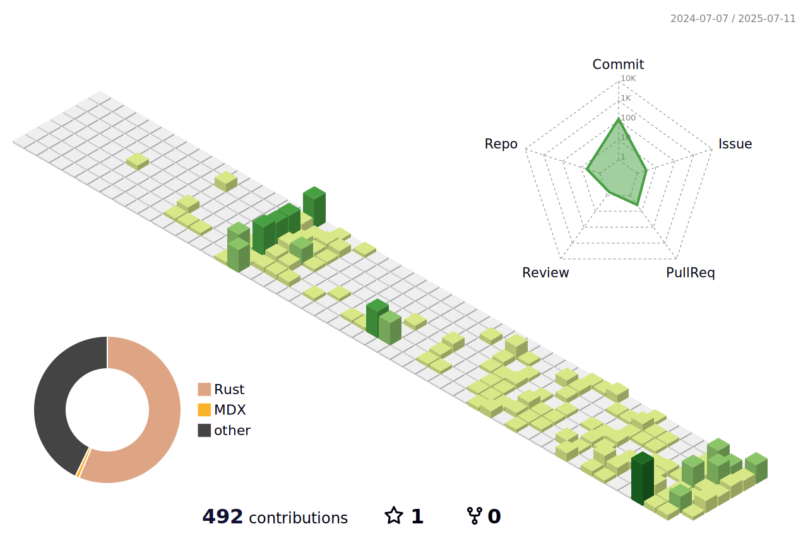

<h1 align="center">Hi 👋 I'm Vincent</h1>

  📌 <strong>Start here:</strong> 
  <a href="https://github.com/VinEckSie/RustPulse">RustPulse</a> • 
  <a href="https://github.com/VinEckSie/sealed-in-rust">My Rust Book</a> • 
  <a href="https://www.youtube.com/@FearlessInRust">YouTube Channel</a>  
  <em>Rust Software Engineer • Applied Cryptography • Systems Programming</em> 
  <strong>Security and performance aren’t trade-offs — I deliver both.</strong>  
  <a href="mailto:vinecksie@pm.me">Contact Me</a> • 
  <a href="https://www.notion.so/YOUR-LINK">Portfolio</a> • 
  <a href="https://www.linkedin.com/in/vincent-e-926828bb/">LinkedIn</a>

 

## 🚀 What I Build

I develop high-performance Rust software with a strong focus on systems programming and a growing specialization in cryptography.

 

## 🎯 My Vision
-  I build robust cryptography tools in Rust, with a strong focus on security, performance, and real-world usability.
-  I'm naturally drawn to domains like aerospace, defense, decentralized systems, and healthcare — where reliability isn't optional.
  -  Through Sealed in Rust and Fearless in Rust, I teach what I learn and help others build confidently with Rust.

 

## 🧩 Core Products

### RustPulse – Real-Time Server Monitoring System

<!--

-->

> A secure, real-time telemetry engine built entirely in Rust for mission-critical monitoring.
- Edge-ready metrics: CPU, RAM, Disk, Network — fast and local
- API-first design: REST & gRPC with JWT-based authentication
- Persistent telemetry: PostgreSQL & JSONL for reliable storage and auditing

### Cryon (Launching Fall 2025)
> Cryptography Crate for Zero-Trust Rust Systems
> 
### Lendra (Launching Winter 2025) 
> Decentralized Crowdlending Platform for Worldwide Lending Access

 

## 🔐 Sealed in Rust — A Practical Guide to Cryptography

📖 [Start reading now](https://VinEckSie.github.io/sealed-in-rust) — chapters released progressively
> A hands-on book for Rust developers who want to build secure systems from the ground up — one primitive at a time.

- Covers real-world implementations of AES, RSA, SHA2, Ed25519, Diffie-Hellman, and more
- Designed for systems programmers: secure APIs, zero-copy patterns, and Rust-native design
- Includes use cases from blockchain, defense, aerospace, healthcare and more
- Backed by working code examples and CLI tools to learn by doing

 

## 🎥 Fearless in Rust — YouTube Channel

> Fearless in Rust is my YouTube channel where I share real Rust projects, cryptography concepts, and beginner-friendly lessons.

- Behind-the-scenes of my core products — design, decisions, architecture  
- Cryptography deep dives inspired by Sealed in Rust 
- Rust fundamentals, explained simply — perfect for new systems developers  

 

## 🧪 Side Skills

📂 [Browse the challenge repo](https://github.com/VinEckSie/side-skills-products)
> I'm sharpening my Rust through real-world systems programming and platform-level tooling.

- Built from scratch: HTTP server, Redis, Kafka, DNS resolver, SQLite engine — via CodeCrafters challenges
- Exploring infrastructure: Docker, Kubernetes, gRPC, Prometheus, Grafana — through personal projects

 

## 🌍 Languages I Use

| Language   | Proficiency    |
|------------|----------------|
| 🇫🇷 French   | Native         |
| 🇬🇧 English  | [C1 (IELTS prep)](https://drive.proton.me/urls/FGH49T2Q9W#tdqOX2hJ65Tq)|
| 🇩🇪 German   | B1 (intermediate) |

<!--

-->

 

## 📊 GitHub Activity

 

<!---->

## 📡 Connect & Follow Me

### 📇 Contact & Profiles  

  

### 🌍 Communities & Social  

### 🎓 Content & Learning  

🛠️ Built with Rust • Last updated: July 2025

<!--
   

-->
<!--

-->

