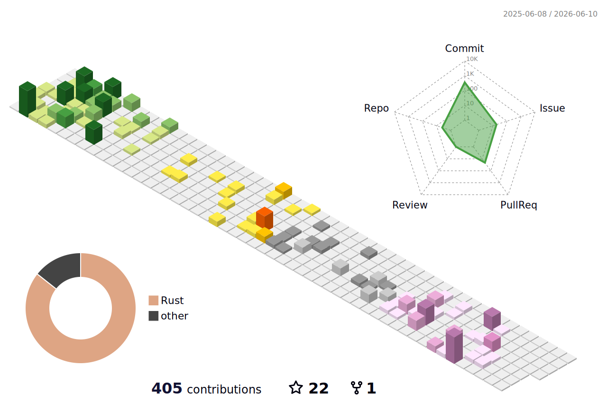

<h1 align="center">Hi 👋 I'm Vincent</h1>

## Rust Engineer 🦀 | Systems · Security · Design

15 years in enterprise software — now fully focused on Rust.  
I build well-structured systems with emphasis on architecture, correctness, and performance.

---

## 🛰 Projects

[🛰 RustPulse](https://vinecksie.super.site/rustpulse) — telemetry engine in Rust exploring async processing, observability, and clean architecture  
([source code](https://github.com/VinEckSie/rustpulse))

[📖 Sealed in Rust](https://vinecksie.super.site/sealed-in-rust) — applied cryptography in Rust through practical implementations of secure primitives

[🎥 Fearless in Rust](https://www.youtube.com/@FearlessInRust) — educational content on Rust, systems, and secure software design

---

## 🧩 Focus

Systems design • Async Rust • Distributed systems • Applied cryptography • Clean architecture

---

## 🔧 Tech

Rust · gRPC · PostgreSQL · Tracing · Prometheus · Docker · GitHub Actions

---

## 🌍 Find Me

[Rust Works](https://vinecksie.super.site/) ·  
[LinkedIn](https://www.linkedin.com/in/vincent-eckert-sierota-926828bb/) ·  
[Email](mailto:vessystems@pm.me) ·  
[WhatsApp Business](https://wa.me/447400700660?text=Hello%2C%20I%27m%20interested%20in%20your%20services)

---

## 📊 Activity

