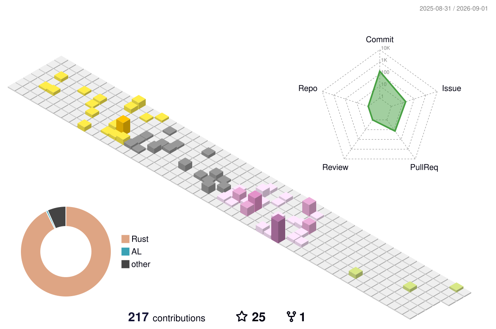

<h1 align="center">Hi 👋 I'm Vincent</h1>

## Senior Microsoft Dynamics 365 Technical Consultant & Developer

15+ years of experience delivering enterprise solutions across **Dynamics 365, Power Platform, Azure, and enterprise integrations**.

I design and develop scalable Microsoft business solutions across the full project lifecycle — from solution design and customization to integration, deployment, and production support.

My GitHub highlights **Microsoft Dynamics 365 Business Central / AL development**, alongside selected **Rust engineering projects** focused on systems, architecture, and security.

---

## 🔷 Microsoft

### [Dynamics 365 Business Central](https://github.com/VinEckSie/business_central)

Microsoft Dynamics 365 Business Central extensions and AL development projects.

---

## 🦀 Rust

### [RustPulse](https://github.com/VinEckSie/rustpulse)

Async telemetry engine exploring clean architecture, observability, and reliable distributed systems.

### [Sealed in Rust](https://github.com/VinEckSie/sealed-in-rust)

Applied cryptography through practical Rust implementations and system-oriented design.

---

## 🔧 Expertise

Dynamics 365 · Finance & Operations · Customer Engagement · Business Central · Power Platform · Azure · AL · C# · Enterprise Integrations · Solution Architecture

---

## 🌍 Connect

[LinkedIn](https://www.linkedin.com/in/vincent-eckert-sierota-926828bb/) · [Email](mailto:vessystems@pm.me)

---

## 📊 Activity

