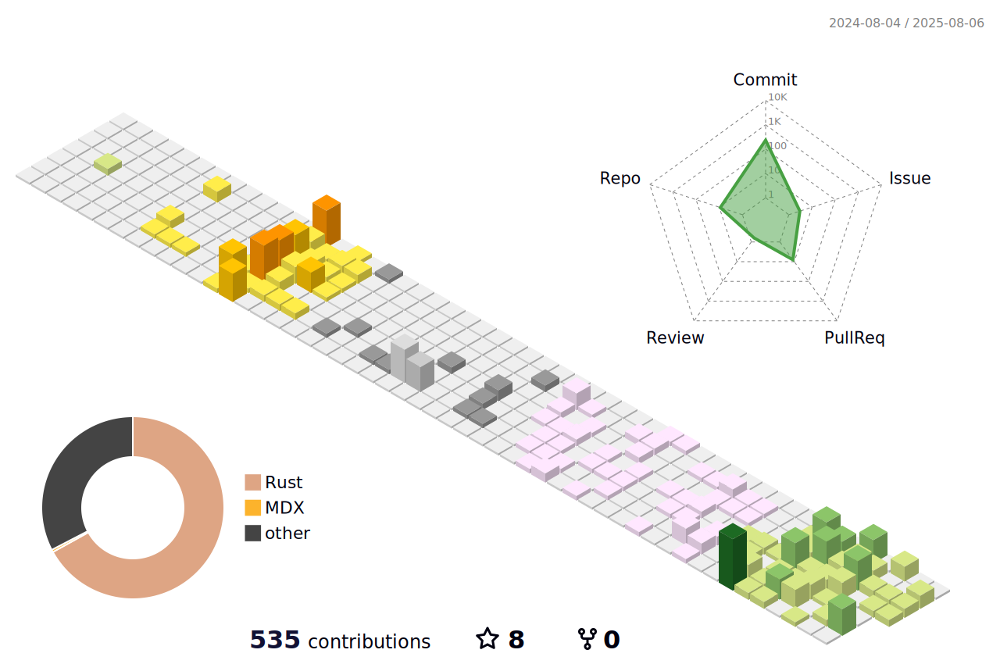

<h1 align="center">Hi 👋 I'm Vincent</h1>

## Rust Engineer for Next-Generation Critical Systems 🦀 | Backend · Systems · Security

15 years in enterprise software — now fully focused on Rust.  
I build secure, high-performance backends and distributed systems, with hands-on experience in systems-level design.  
Passionate about leveraging Rust to power the **next-generation critical systems (Aerospace · Health · Infrastructure).**

 

[🛰 RustPulse](https://vinecksie.super.site/rustpulse) — open telemetry engine in Rust
([source code](https://github.com/VinEckSie/rustpulse))

[🎥 Fearless in Rust](https://www.youtube.com/@FearlessInRust) — teaching Rust, systems & security

[📖 Sealed in Rust](https://vinecksie.super.site/sealed-in-rust) — cryptography in Rust, from primitives to practice

## 🧩 What I Build
- Secure Rust backends and real-time systems
- Applied cryptography tools (AES, RSA, Ed25519, etc.)
- Robust architectures for aerospace, defense, and distributed systems

## 🔧 Tech Stack

Rust · Axum · Tonic (gRPC) · PostgreSQL · Redis · Tracing · Prometheus · Docker · Kubernetes · GitHub Actions · JWT · TLS

## 🌍 Find Me

[Rust Works](https://vinecksie.super.site/)  ·  [WhatsApp Business](https://wa.me/447400700660?text=Hello%2C%20I%27m%20interested%20in%20your%20services) · [LinkedIn](https://www.linkedin.com/in/vincent-eckert-sierota-926828bb/)  · [Email](mailto:vessystems@pm.me)

 

## 📊 Activity

